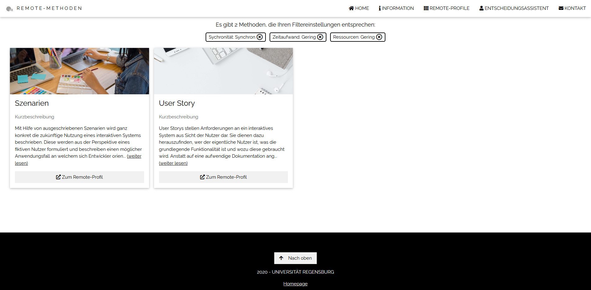
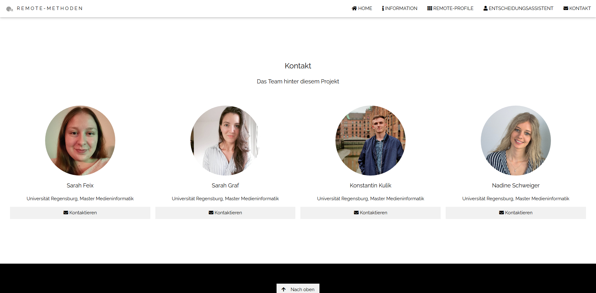
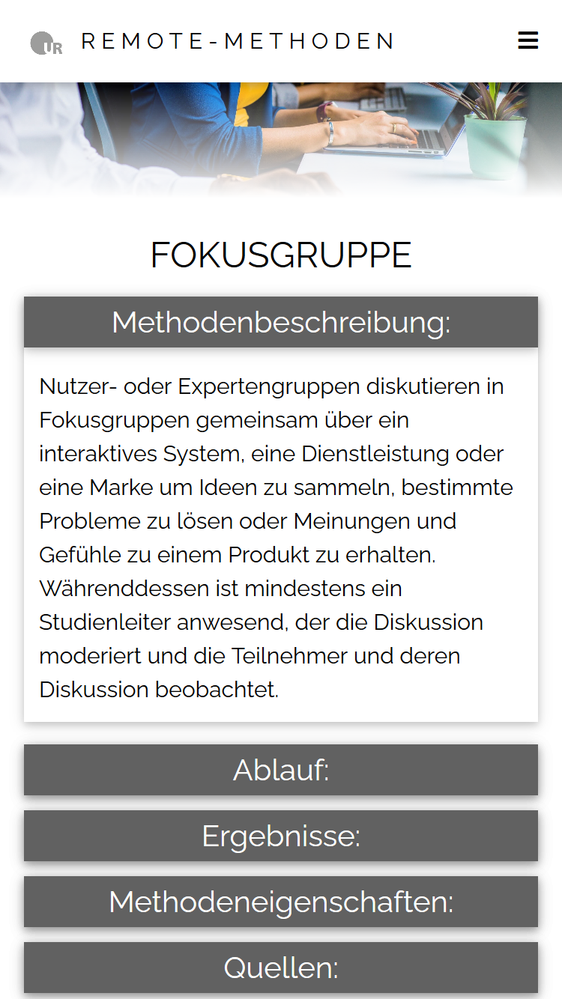
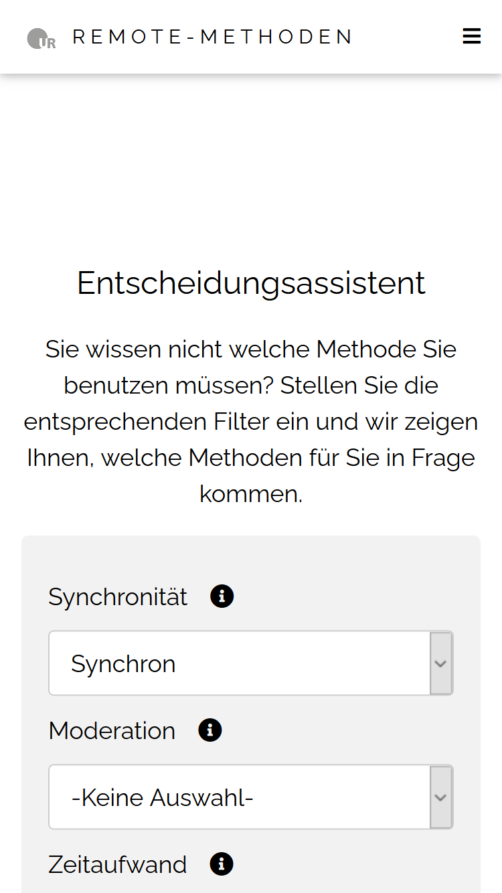

# Remote-Methoden

In Zeiten der Corona Pandemie ist das Durchführen von Studien nicht mehr wie gewohnt möglich. Um ein effektives Arbeiten weiterhin zu gewährleisten, bietet diese Web Applikation den Studenten und dem Lehrstuhl Medieninformatik der Universität Regensburg Wissen bezüglich Remote-Methoden. Dabei beschreiben einzelne Remote-Profile die Methoden, erklären den Ablauf, liefern Aufschluss über die Ergebnisse, nennen spezielle Eigenschaften und verweisen auf informative Verlinkungen. Ein Entscheidassistent dient als Filtersystem. Dabei werden dem Nutzer durch individuelle Angaben passende Remote-Methoden vorgeschlagen.

Das ist der Link zu einer funktionierenden, im WWW-gehosteten Version der Anwendung (auf Groß- & Kleinschreibung achten): <a href="https://kotjik.github.io/Remote-Methoden/app/index.html">https://kotjik.github.io/Remote-Methoden/app/index.html</a>

[Screenshot einfügen: Homepage]

## Team

|  |  |  |  |
|:-----------------:|:-----------------:|:-----------------:|:-----------------:|
| **Sarah Feix**  E-Mail: sarah.feix@stud.uni-regensburg.de  Github-Nutzer: SaRaHfE | **Sarah Graf**  E-Mail: sarah.graf@stud.uni-regensburg.de  Github-Nutzer: sarah-graf | **Konstantin Kulik**   E-Mail: konstantin.kulik@stud.uni-regensburg.de  Github-Nutzer: Kotjik | **Nadine Schweiger**    E-Mail: nadine.schweiger@stud.uni-regensburg.de  Github-Nutzer: NadineSchweiger |

## Beschreibung

[Platzhalter]

### Home

Dieser Punkt stellt den Willkommens-Bildschirm dar. Hier steht eine kurze Beschreibung der Website inklusive deren Zweck und verweist auf weitere Links und Funktionen.

[Screenshot einfügen: Home]

### Infos

blablba

[Screenshot einfügen: Infos]
TBD

### Remote-Profile

In diesem Abschnitt werden sämtliche Remote Methoden in Form von Kurprofilen als Karten dargestellt. Pro Kurzprofil wird eine kleine Grafik, der Name der Methode, eine Kurzbeschreibung der Methode und ein Link auf die Detailseite der Methode angezeigt. Der Nutzer kann hier auch über eine Suchleiste nach bestimmten Methoden suchen.

[Screenshot einfügen: Remote-Profile]

 

### Entscheidungsassistent

Der Entscheidungsassistent hilft dem Nutzer in Form von Filtereinstellungen nach Remote Methoden zu suchen. Benötigt der Nutzer beispielsweise eine Remote Methode, welche qualitative Ergebnisse liefert und nur wenig Ressourcen in Anspruch nimmt, kann er das in den Filtereinstellungen angeben und der Assistent zeigt daraufhin alle passenden Remote Methoden. Die eingestellten Filter werden dann als Tags mit aufgelistet. Diese kann man dann mit einem Klick auf das "x" entfernen und die Filtereinstellung wird darauf hin nicht mehr berücksichtigt und die Ergebnisse werden angepasst.

[Screenshot einfügen: Entscheidassistent]

 

### Kontakt

Unter diesem Punkt werden die Personen aufgelistet, die in diesem Projekt mitgearbeitet haben. Es wird die Möglichkeit gegeben jeden dieser Personen per Mail zu kontaktieren.

[Screenshot einfügen: Kontakt]

### Detailseiten

Für jede Remote Methode gibt es eine eigene Detailseite auf der jegliche Informationen dazu aufgelistet werden. Für jede Remote Methode gibt es eine Methodenbeschreibung, einen Ablauf / eine Anleitung, Ergebnisse / Was man mit dieser Methode erreichen will, methodeneigenschaften für das Filtersystem und Lunks zu weiteren Infos / Papern.

[Screenshot einfügen: Detailseite]

### Responsive

Die komplette Anwendung wurde auch für die mobile Ansicht optimiert. Jeder Unterpunkt und Funktion wird auch für Smartphones oder Tablets ideal angezeigt und funktioniert fehlerfrei.

[Screenshots einfügen - Mobile Ansicht] 

|  |  |  |
|:-----------------:|:-----------------:|:-----------------:|
| Startbildschirm | Menü | Detailseite |
 

|  |  |  |
|:-----------------:|:-----------------:|:-----------------:|
| Remote-Profile | Entscheidungsassistent | Kontakt |
